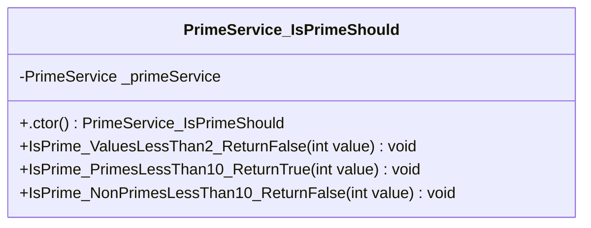
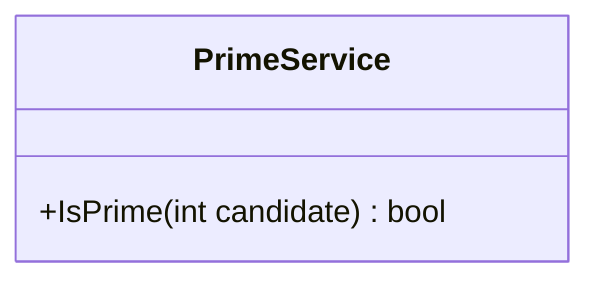

<!-- markdownlint-capture -->
<!-- markdownlint-disable -->

# Code Metrics

This file is dynamically maintained by a bot, *please do not* edit this by hand. It represents various [code metrics](https://aka.ms/dotnet/code-metrics), such as cyclomatic complexity, maintainability index, and so on.

## PrimeService.Tests :heavy_check_mark:

The *PrimeService.Tests.csproj* project file contains:

- 1 namespaces.
- 1 named types.
- 49 total lines of source code.
- Approximately 18 lines of executable code.
- The highest cyclomatic complexity is 1 :heavy_check_mark:.

  <strong id="prime-unittests-services">
    Prime.UnitTests.Services :heavy_check_mark:
  </strong>

 

The `Prime.UnitTests.Services` namespace contains 1 named types.

- 1 named types.
- 49 total lines of source code.
- Approximately 18 lines of executable code.
- The highest cyclomatic complexity is 1 :heavy_check_mark:.

  <strong id="primeservice_isprimeshould">
    PrimeService_IsPrimeShould :heavy_check_mark:
  </strong>

 

- The `PrimeService_IsPrimeShould` contains 5 members.
- 46 total lines of source code.
- Approximately 18 lines of executable code.
- The highest cyclomatic complexity is 1 :heavy_check_mark:.

| Member kind | Line number | Maintainability index | Cyclomatic complexity | Depth of inheritance | Class coupling | Lines of source / executable code |
| :-: | :-: | :-: | :-: | :-: | :-: | :-: |
| Field | <a href='https://github.com/maibine/git_training/blob/master/unit-testing-using-dotnet-test/PrimeService.Tests/PrimeService_IsPrimeShould.cs#L8' title='PrimeService PrimeService_IsPrimeShould._primeService'>8</a> | 100 | 0 :heavy_check_mark: | 0 | 1 | 1 / 0 |
| Method | <a href='https://github.com/maibine/git_training/blob/master/unit-testing-using-dotnet-test/PrimeService.Tests/PrimeService_IsPrimeShould.cs#L10' title='PrimeService_IsPrimeShould.PrimeService_IsPrimeShould()'>10</a> | 100 | 1 :heavy_check_mark: | 0 | 1 | 4 / 1 |
| Method | <a href='https://github.com/maibine/git_training/blob/master/unit-testing-using-dotnet-test/PrimeService.Tests/PrimeService_IsPrimeShould.cs#L45' title='void PrimeService_IsPrimeShould.IsPrime_NonPrimesLessThan10_ReturnFalse(int value)'>45</a> | 72 | 1 :heavy_check_mark: | 0 | 4 | 11 / 6 |
| Method | <a href='https://github.com/maibine/git_training/blob/master/unit-testing-using-dotnet-test/PrimeService.Tests/PrimeService_IsPrimeShould.cs#L33' title='void PrimeService_IsPrimeShould.IsPrime_PrimesLessThan10_ReturnTrue(int value)'>33</a> | 72 | 1 :heavy_check_mark: | 0 | 4 | 13 / 6 |
| Method | <a href='https://github.com/maibine/git_training/blob/master/unit-testing-using-dotnet-test/PrimeService.Tests/PrimeService_IsPrimeShould.cs#L20' title='void PrimeService_IsPrimeShould.IsPrime_ValuesLessThan2_ReturnFalse(int value)'>20</a> | 75 | 1 :heavy_check_mark: | 0 | 4 | 11 / 5 |

<a href="#PrimeService_IsPrimeShould-class-diagram">:link: to `PrimeService_IsPrimeShould` class diagram</a>

<a href="#prime-unittests-services">:top: back to Prime.UnitTests.Services</a>

<a href="#primeservice-tests">:top: back to PrimeService.Tests</a>

## PrimeService :heavy_check_mark:

The *PrimeService.csproj* project file contains:

- 1 namespaces.
- 1 named types.
- 21 total lines of source code.
- Approximately 6 lines of executable code.
- The highest cyclomatic complexity is 4 :heavy_check_mark:.

  <strong id="prime-services">
    Prime.Services :heavy_check_mark:
  </strong>

 

The `Prime.Services` namespace contains 1 named types.

- 1 named types.
- 21 total lines of source code.
- Approximately 6 lines of executable code.
- The highest cyclomatic complexity is 4 :heavy_check_mark:.

  <strong id="primeservice">
    PrimeService :heavy_check_mark:
  </strong>

 

- The `PrimeService` contains 1 members.
- 18 total lines of source code.
- Approximately 6 lines of executable code.
- The highest cyclomatic complexity is 4 :heavy_check_mark:.

| Member kind | Line number | Maintainability index | Cyclomatic complexity | Depth of inheritance | Class coupling | Lines of source / executable code |
| :-: | :-: | :-: | :-: | :-: | :-: | :-: |
| Method | <a href='https://github.com/maibine/git_training/blob/master/unit-testing-using-dotnet-test/PrimeService/PrimeService.cs#L6' title='bool PrimeService.IsPrime(int candidate)'>6</a> | 69 | 4 :heavy_check_mark: | 0 | 1 | 16 / 6 |

<a href="#PrimeService-class-diagram">:link: to `PrimeService` class diagram</a>

<a href="#prime-services">:top: back to Prime.Services</a>

<a href="#primeservice">:top: back to PrimeService</a>

## Metric definitions

  - **Maintainability index**: Measures ease of code maintenance. Higher values are better.
  - **Cyclomatic complexity**: Measures the number of branches. Lower values are better.
  - **Depth of inheritance**: Measures length of object inheritance hierarchy. Lower values are better.
  - **Class coupling**: Measures the number of classes that are referenced. Lower values are better.
  - **Lines of source code**: Exact number of lines of source code. Lower values are better.
  - **Lines of executable code**: Approximates the lines of executable code. Lower values are better.

## Mermaid class diagrams

##### `PrimeService_IsPrimeShould` class diagram

##### `PrimeService` class diagram

*This file is maintained by a bot.*

<!-- markdownlint-restore -->
